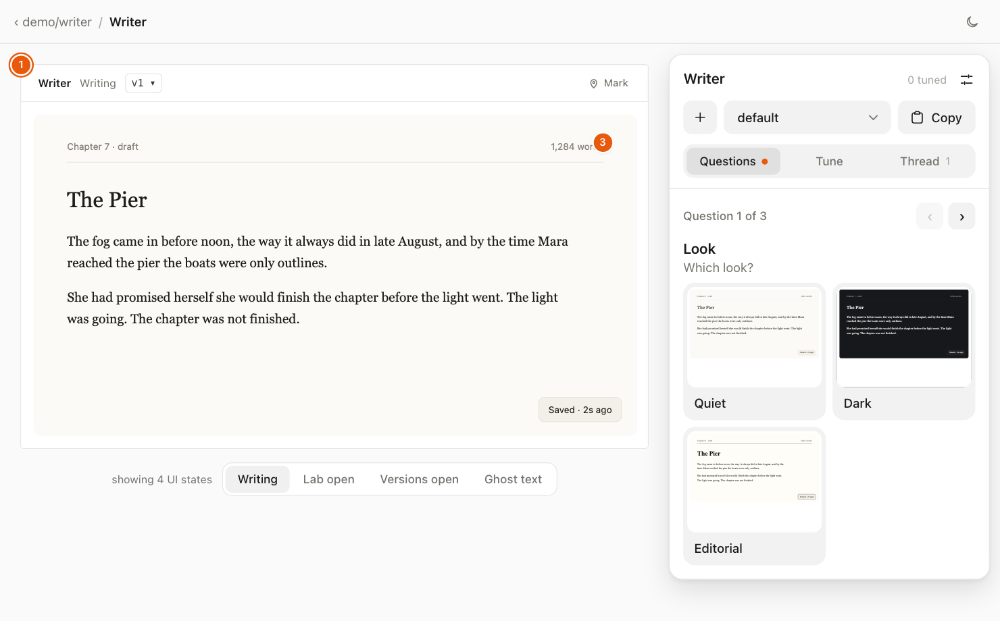
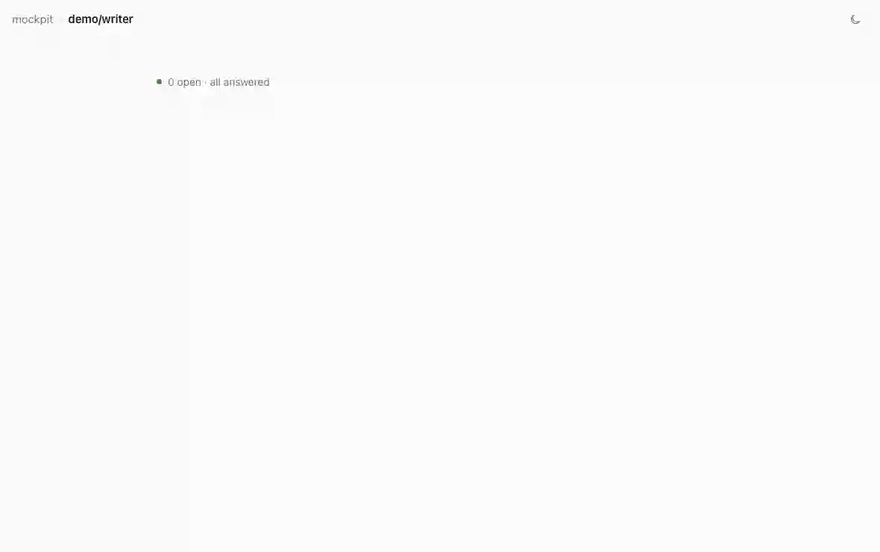
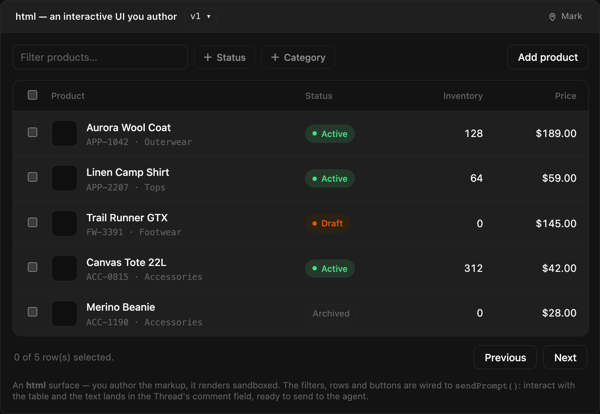
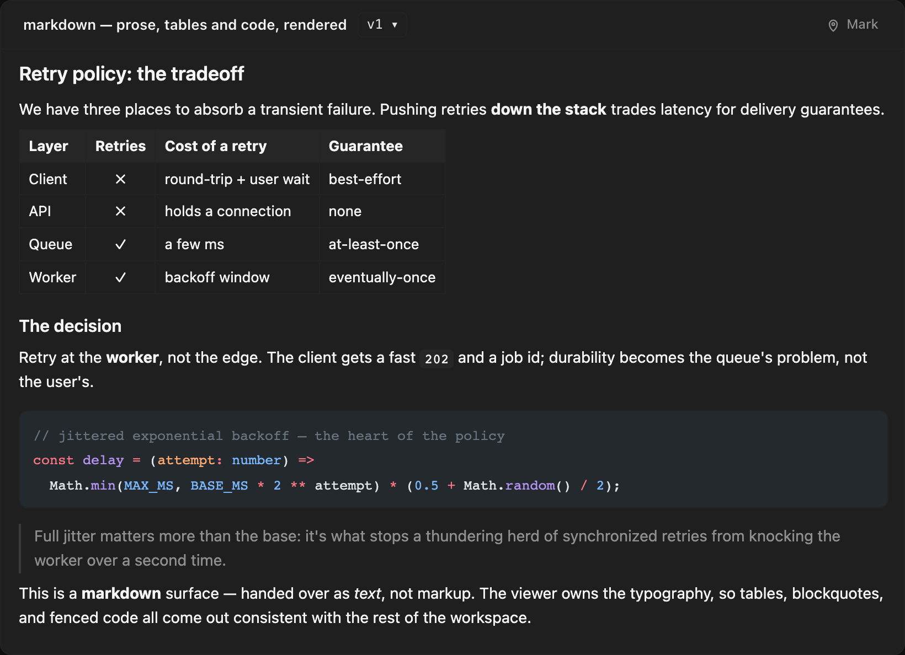
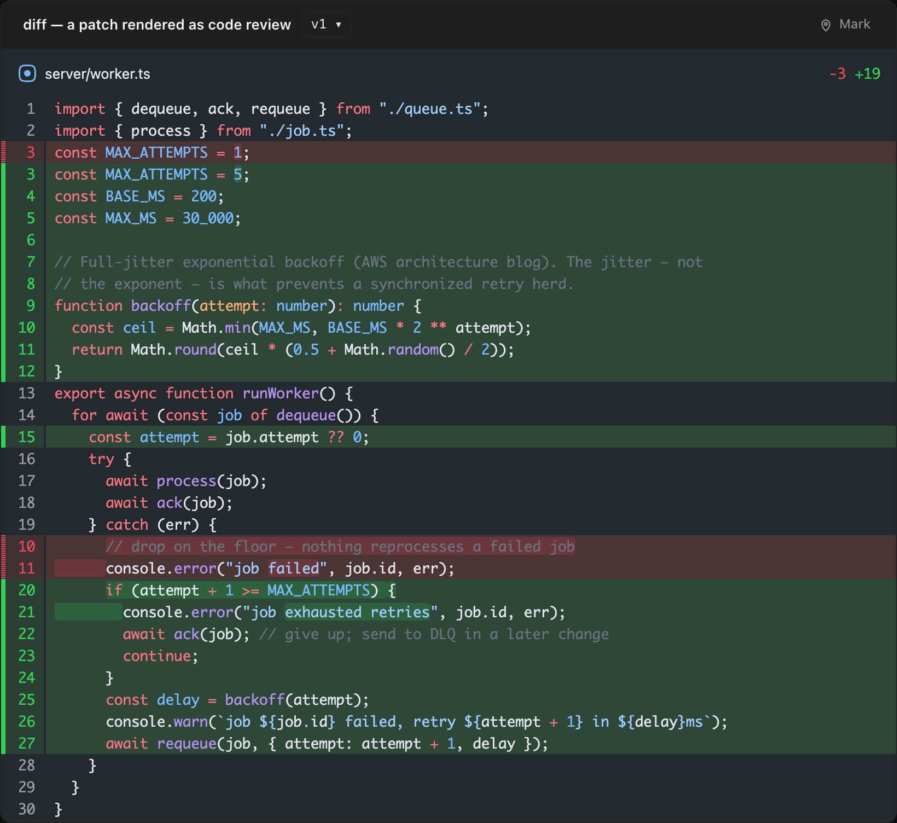
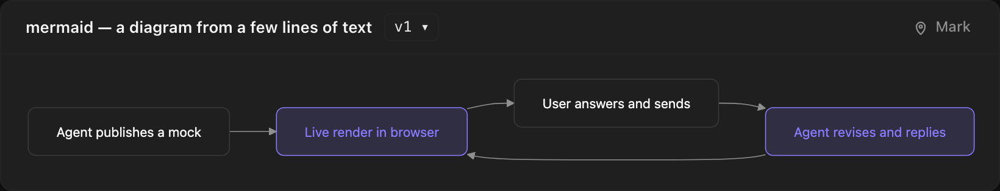

# mockpit

**A design-decision loop for terminal coding agents.**

Your agent publishes a mock (a page or a component) in each of its UI states and
in a few parallel looks. It shows up live in your browser with the agent's
questions beside it: pick a look from pictures, tune the knobs it exposed, leave
comments on the parts it marked, then press **Send**. The agent wakes once with
the whole batch and revises.

<table>
  <tr>
    <td width="50%" valign="top">
      <picture>
        <source media="(prefers-color-scheme: dark)" srcset="docs/mockpit-dark.png">
        
      </picture>
    </td>
    <td width="50%" valign="top">
      
    </td>
  </tr>
</table>

## Fork of sideshow

mockpit is a fork of [sideshow](https://github.com/modem-dev/sideshow) by
[Ben Vinegar](https://github.com/benvinegar), sponsored by
[Modem](https://modem.dev). The renderer, sandboxing, MCP/CLI/HTTP tiers and
Cloudflare deploy all come from that work. Thank you.

Upstream is a live visual surface where agents post renders and you comment.
mockpit turns that into a design-decision loop:

|               | sideshow                                           | mockpit                                                                                                                        |
| ------------- | -------------------------------------------------- | ------------------------------------------------------------------------------------------------------------------------------ |
| Structure     | A stream of posts per session                      | **project › mock › state › variant › version**: a repo, a page or component by slug, its UI states, parallel looks, history    |
| Questions     | Free-text comments                                 | The agent asks; you answer in place, picking from pictures of each option                                                      |
| Tuning        | —                                                  | Knobs the agent declares (sliders, colours, springs…) on [tunekit](https://github.com/fabiogaliano/tunekit), live on the stage |
| Comments      | Text on a post                                     | Anchored on a **part** the agent marked with `data-part`, in a given state                                                     |
| Feedback      | Each comment reaches the agent as it's written     | Picks, tuned values, mix and comments stay drafts until you **Send**, then go out as one reply                                 |
| Design system | Built-in viewer themes                             | `mockpit init` detects the repo's tokens, fonts and kit so the agent's markup matches your codebase                            |
| Agent verbs   | Post-level: `publish`, `update`, `wait`, `comment` | Mock-level: `init`, `publish`, `ask`, `wait`, `revise`, `comment`, `status`, `show`, `export`                                  |

## The loop

1. **Publish.** The agent publishes each state of the mock ("Writing", "Lab
   open") in one or more variants ("quiet", "dark"). One stage shows the mock;
   the strip under it switches states.
2. **Ask.** The agent asks what it can't decide alone: which look, where a
   panel goes, which of two layouts. Options bound to a variant or to knob
   values render as pictures; hovering one previews it on the stage, clicking
   picks it. After the look, **Mix** offers to borrow a part from another look.
3. **Tune.** Parts the agent marked are selectable on the stage. Tune lists
   them with the knobs it declared for each, plus a comment field. Presets
   save a set of tuned values in your browser.
4. **Send.** Everything above is a draft (it survives a reload) until one
   **Send**. A mock without questions gets **Accept / Revise / Drop** instead.
   The Send lands in the Thread, marked ✓ sent and ✓✓ once the agent has read
   it.
5. **Revise.** The agent gets one reply: answers, tuned values, mix, comments.
   It publishes the next version; the frame header's `v3 ▾` lists the history,
   and an older version opens under a banner with "restore as vN". Looks that
   lost are archived, not deleted.

**Home** lists the project's mocks with a thumbnail, their states and how many
questions are open, with "Answer next ›" to jump to the first one. Dark and
light themes, toggled from the top bar. On a narrow screen the panel becomes a
bottom sheet.

## Quick start

Requires Node 22.18 or newer.

```sh
git clone https://github.com/fabiogaliano/mockpit && cd mockpit
npm install
npm start                      # viewer on http://localhost:8228
npm link                       # puts the `mockpit` CLI on your PATH
```

Point your agent at it by pasting the setup block into its instructions:

```sh
curl -s http://localhost:8228/setup >> AGENTS.md
```

Then run `mockpit init` once per repo and ask the agent to "mock this up on
mockpit". No agent handy? `mockpit demo` seeds the Writer: one mock in four
states and three looks, with questions, knobs and marked parts.

MCP, the Pi extension and the Claude Code plugin are covered in
**[docs/connecting-agents.md](docs/connecting-agents.md)**.

## What a mock can show

A version is an ordered list of **surfaces**, and one version can carry several.
Html is what design mocks use and the only kind with parts and knobs; the others
render the same way on the stage.

<table>
  <tr>
    <td width="50%" valign="top">
      
      <p><b><code>html</code></b>: markup the agent authors, rendered in a sandbox and themed by your design system.</p>
    </td>
    <td width="50%" valign="top">
      
      <p><b><code>markdown</code></b>: prose, tables and fenced code.</p>
    </td>
  </tr>
  <tr>
    <td width="50%" valign="top">
      
      <p><b><code>diff</code></b>: a patch as a syntax-highlighted code review (unified or split).</p>
    </td>
    <td width="50%" valign="top">
      
      <p><b><code>mermaid</code></b>: diagram source rendered to SVG in the viewer palette.</p>
    </td>
  </tr>
</table>

There are also `terminal` (ANSI output), `image` (uploaded assets), `json`
(collapsible tree) and `code` (shiki-highlighted source with line numbers).

## Agent verbs

The same verbs on every tier, with the same fields: a zero-dependency CLI for
agents with only a shell, MCP over stdio or streamable HTTP at `/mcp`, and plain
HTTP.

| CLI               | MCP                 | HTTP                                             |
| ----------------- | ------------------- | ------------------------------------------------ |
| `mockpit init`    | —                   | —                                                |
| `mockpit publish` | `publish_mock`      | `POST /api/mocks`                                |
| `mockpit revise`  | `revise_mock`       | `POST /api/mocks/:id/revise`                     |
| `mockpit ask`     | `ask_user`          | `POST /api/mocks/:id/asks`                       |
| `mockpit wait`    | `wait_for_feedback` | `GET /api/comments?session=…&author=user&wait=N` |
| `mockpit comment` | `reply_to_user`     | `POST /api/comments`                             |
| `mockpit status`  | `list_mocks`        | `GET /api/mocks`                                 |
| `mockpit show`    | `get_mock`          | `GET /api/mocks/:id`                             |
| `mockpit export`  | `export_mock`       | `GET /api/mocks/:id/export`                      |
| `mockpit upload`  | `upload_asset`      | `POST /api/assets`                               |

The running server serves the agent how-to at `/agent-howto` and the html
contract at `/guide`.

## Run it anywhere

It runs locally as a small Node server (SQLite at `~/.mockpit/mockpit.db`), or on
Cloudflare Workers when your agent and browser are on different machines. See
**[docs/deploying.md](docs/deploying.md)**.

The server app is importable from `mockpit/server` (`createApp`, `SqlStore`,
`createSqliteStorage`). The embeddable viewer engine (`mockpit/viewer-embed`,
`mountViewer`) is gone: the viewer is self-hosted only.

## Migrating from 0.x

- **SQLite workspaces migrate in place on first boot.** Each item becomes a
  single-state mock with its variants and version history; comments keep their
  ids and sequence numbers, so agents' feedback cursors carry over. Comments a
  user was still drafting become the mock's draft. Deployed Durable Objects
  migrate the same way.
- **The JSON store is gone.** If you run with `MOCKPIT_STORE=json`, start your
  current version once without it **before upgrading**:
  `env -u MOCKPIT_STORE mockpit serve` (keep `MOCKPIT_DATA`/`MOCKPIT_DB` if you
  set them). That first SQLite boot copies `~/.mockpit/mockpit.json` into
  `~/.mockpit/mockpit.db`, as long as the database is still empty; then upgrade.
  The JSON file is left untouched either way.
- **`--item` is now `--mock`** (`mockpit publish --mock <slug> --state <s>
--variant <v>`), and the MCP tools are `*_mock` (`publish_mock`,
  `revise_mock`, `list_mocks`, `get_mock`, `export_mock`).
- **Removed:** the item, post, snippet and session-page routes
  (`/api/projects/:name/items`, `/api/posts`, `/api/surfaces`, `/api/snippets`,
  `/session/:id`, `/p/:id`), `?part=`, the item/post MCP tools and their
  deprecated aliases (`publish_item`, `publish_post`, `publish_surface`, …), the
  CLI's `page`, `list`, `sessions`, `update`, per-kind shortcuts (`markdown`,
  `diff`, …), `test-post` and `trace*` commands, the github/gruvbox/one themes
  and the embed engine. Agents should re-fetch `/agent-howto`; refresh pasted
  setup blocks from `/setup`.

## Development

```sh
npm run dev          # server with watch + viewer watch build
npm test             # Node unit/API/store tests + viewer unit tests
npm run test:worker  # local workerd + Durable Object integration
npm run typecheck    # node + workers + viewer
npm run lint         # oxlint
npm run format       # oxfmt
npm run test:e2e     # Playwright, chromium + webkit (bridge, mock screen, decide flow)
```

The architecture and contributor rules are in [AGENTS.md](AGENTS.md).

## License

[MIT](LICENSE). The original sideshow copyright is retained.
